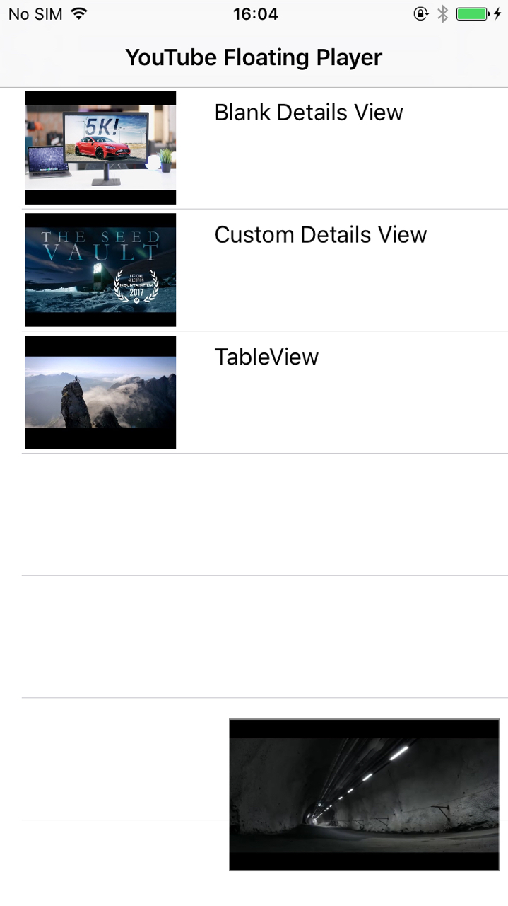

# YouTubeFloatingPlayer

A Swift-based video player inspired by YouTube. Based on [SwiftYouTubeFloatingPlayer](https://github.com/hanappaula/SwiftYouTubeFloatingPlayer).

[](http://cocoapods.org/pods/YouTubeFloatingPlayer)
[](http://cocoapods.org/pods/YouTubeFloatingPlayer)
[](http://cocoapods.org/pods/YouTubeFloatingPlayer)

<table>
	<tr>
		<th>
			
		</th>
		<th>
			
		</th>
	</tr>
</table>
<table>
	<tr>
		<td>
		
		</td>
	</tr>
</table>

## Features

- Interactive, drag to minimize, swipe to dismiss
- Supports TableView as well as any UIView for displaying video details

## Requirements

Currently YTFPlayer is only supported on applications supporting only portrait orientations. To implement the following code must be implemented in the AppDelegate :

```swift
func application(application: UIApplication, supportedInterfaceOrientationsForWindow window: UIWindow?) -> UIInterfaceOrientationMask {
    return UIInterfaceOrientationMask.portrait
}
```

## Dependencies

- [YouTube Helper](https://github.com/youtube/youtube-ios-player-helper)

## Example

To run the example project, clone the repo, and run `pod install` from the Example directory first.

## Installation

[CocoaPods](http://cocoapods.org) is a dependency manager for Cocoa projects. You can install it with the following command:

```bash
$ gem install cocoapods
```

To integrate YouTubeFloatingPlayer into your Xcode project using CocoaPods, specify it in your `Podfile`:

```swift
source 'https://github.com/CocoaPods/Specs.git'

platform :ios, '9.0'
use_frameworks!

target '<Your Target Name>' do
    pod 'YouTubeFloatingPlayer'
end
```

Then, run the following command:

```bash
$ pod install
```

## Usage

Import the library:

```swift
import YouTubeFloatingPlayer
```

Use `YTFPlayer.initYTF()` method to initialise Player with desired properties.

```swift
let videoID = "f0NdOE5GTgo"
```

```swift
// Initiates Player with an empty details view
YTFPlayer.initYTF(with: UIView(), videoID: videoID)
```

```swift
// Initiates Player with a tableView with other content
YTFPlayer.initYTF(with: tableView, tableCellNibName: "VideoCell", tableCellReuseIdentifier: "videoCell", videoID: videoID)
```

Once initialised, use `YTFPlayer.showYTFView()` method with its parameter set to the desired ViewController.

```swift
YTFPlayer.showYTFView(viewController: self)
```

Finally, use the `finishYTFView()` method to remove the Player from the view.
```swift
// Remove Player
finishYTFView(animated: true)

```


## Author

Advaita Pandya, adipandya@gmail.com

## License

YouTubeFloatingPlayer is available under the GNU GPLv3 license. See the LICENSE file for more info.
